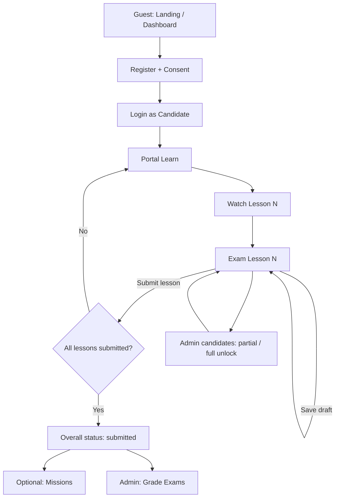

# ICT Representative — Project Document for Supervisor

**System name (UI):** ICT Representative  
**Repository:** OBEC_ICT  
**Stack:** Next.js (App Router) · TypeScript · Tailwind CSS · Supabase (PostgreSQL + RPC)  
**Purpose:** Register school ICT representatives, deliver video lessons with per-lesson quizzes, track progress by school/district, and provide admin / executive oversight.

---

## 1. Executive summary

The system supports a national ICT representative programme for schools under OBEC. End users register, watch ordered lesson videos, and submit quizzes **per lesson**. Overall exam status becomes fully submitted only when **all** lessons are submitted. Administrators manage projects (schedule, videos, questions), users, grading, and exam unlock. Executive roles (Business / Audit) view dashboards. Access is enforced by role cookies and path rules in middleware.

---

## 2. User levels (roles)

| Level | Session kind | Portal / access role | Who | Home after login |
|-------|--------------|----------------------|-----|------------------|
| Guest | — | `guest` | Public visitor | `/` |
| Candidate (member) | `candidate` | `user` | Registered ICT representative | `/dashboard` |
| School admin (candidate) | `candidate` | `school_admin` | Same learning path + school profile edit | `/dashboard` |
| Business executive | `business` | `business` | Project-wide executive dashboard | `/portal/business` |
| Audit executive | `audit` | `audit` | District-scoped audit dashboard | `/portal/audit` |
| Admin | `admin` | `admin` | Project ops, users, exams | `/admin` |
| Super admin | `admin` (`super_admin`) | `admin` | All admin + site config, admin accounts, audit logs | `/admin` |

**Notes**

- Candidate identity uses a generated **member number** (`profile_id`), not National ID in primary UI labels.
- `school_admin` may also be flagged via `is_school_admin`.
- Admin sub-roles: `admin` vs `super_admin` (extra menus only for super admin).
- Path matrix: `src/lib/auth/access.ts` + `middleware.ts`.

---

## 3. Page map by area

### 3.1 Public

| Path | Page | Audience |
|------|------|----------|
| `/` | Landing / programme intro | Everyone |
| `/dashboard` | Registration overview by district (heat / school lists) | Public + all roles |
| `/register/consent` | Consent before registration | Guest |
| `/register/form` | Registration form | Guest |
| `/register/success` | Registration complete | Guest |
| `/login` | Candidate / executive login | Guest |
| `/login/setup-password` | First-time password setup | Candidate |
| `/login/reset-password` | Password reset | Candidate |
| `/login/executive-setup` | Executive first-time setup | Business / Audit |
| `/admin/login` | Admin login | Admin |

### 3.2 Candidate portal (`user` / `school_admin`)

| Path | Page | Feature |
|------|------|---------|
| `/portal/profile` | Personal profile | View / edit own profile |
| `/portal/school-profile` | School profile | **school_admin only** — update school director info, etc. |
| `/portal/learn` | Lessons + quiz entry | YouTube lessons, watch progress, link to per-lesson quiz |
| `/portal/exam` | Per-lesson exam | One section at a time; draft save; **submit per lesson** |
| `/portal/missions` | Missions | Shown when candidate qualifies (post-exam access gate) |

Nav label for learn/exam: **บทเรียนและแบบทดสอบ** → `/portal/learn`.

### 3.3 Executive portal

| Path | Page | Audience |
|------|------|----------|
| `/portal/business` | Business dashboard | Business |
| `/portal/business/profile` | Business profile | Business |
| `/portal/audit` | Audit dashboard (assigned districts) | Audit |
| `/portal/audit/profile` | Audit profile | Audit |

Dashboards track trends such as registrations, learn completed, exam submitted, school updates.

### 3.4 Admin centre

| Path | Page | `admin` | `super_admin` |
|------|------|:-------:|:-------------:|
| `/admin` | Admin home (menu cards) | ✓ | ✓ |
| `/admin/overview` | Overview: registration & exam tracking / exports | ✓ | ✓ |
| `/admin/projects` | Project, schedule, videos, questions, answer keys, **Grade Exams** | ✓ | ✓ |
| `/admin/users` | Search/manage users (role, email, suspend, delete) | ✓ | ✓ |
| `/admin/candidates` | Exam submission management (status, **unlock**, clear exam data) | ✓ | ✓ |
| `/admin/config` | Site settings (name, open registration, announcements) | — | ✓ |
| `/admin/admins` | Manage admin accounts | — | ✓ |
| `/admin/audit` | Audit logs export / clear | — | ✓ |
| `/admin/change-password` | Change admin password | ✓ | ✓ |
| `/admin/registrations` | Registrations-related admin view (legacy/support) | ✓ | ✓ |

---

## 4. End-to-end workflows

### 4.1 Registration (Guest → Candidate)

```
Landing → Consent → Registration form → Success
       → (optional) Login / setup password → Dashboard / Profile
```

- Validates school and personal fields (client helpers + server RPC).
- Creates profile with member number; may require password setup on first login.
- Registration open/closed controlled by site settings (super admin).

### 4.2 Learning + per-lesson exam (Candidate)

```
Login → บทเรียนและแบบทดสอบ (/portal/learn)
      → Watch video (progress saved)
      → CTA “ทำแบบทดสอบประจำบทเรียนนี้”
      → /portal/exam?videoId=…&section=…  (one lesson section only)
      → Save draft and/or Submit this lesson
      → Repeat for each lesson
      → When ALL lessons submitted → overall status = submitted
      → (optional) Missions unlock when rules allow
```

**Status model**

| Concept | Meaning |
|---------|---------|
| Overall `exam_progress.status = draft` | Not all lessons submitted yet (may still have partial lesson submits) |
| Overall `status = submitted` | Every lesson submitted |
| `lesson_submissions[section_id]` | Per-lesson lock: `{ status: "submitted", submitted_at? }` |
| Partial submit (UI) | Draft overall + ≥1 lesson in `lesson_submissions` → admin shows **ส่งบางบทแล้ว** |

Lesson ↔ exam mapping: video order index **1:1** with exam section order.

### 4.3 Admin project setup

```
/admin/projects
  → Ensure active project exists
  → Set schedule windows (e.g. exam open period)
  → Add ordered videos (บทเรียนที่ 1, 2, …)
  → Add questions grouped by exam sections (aligned with video order)
  → Manage answer keys / points / required flags
  → Grade Exams (scores only fully submitted rows; warns if drafts remain)
```

### 4.4 Admin exam unlock / clear (หลังส่งหรือส่งบางบท)

```
/admin/candidates → search by email / name / school
  → Status badge:
      ยังไม่เริ่มสอบ | ฉบับร่าง / กำลังทำ | ส่งบางบทแล้ว | ส่งข้อสอบแล้ว (± ผ่าน/ไม่ผ่าน)
  → ปลดล็อก (Unlock): enabled for full submit OR partial lesson submit
       → status back to draft, clears lesson_submissions locks, keeps answers
  → ล้างข้อมูลสอบ: deletes exam progress row (profile remains)
```

Requires DB migration including `lesson_submissions` and updated `admin_list_exam_progress` / `admin_unlock_exam` (see `supabase/lesson_submissions_v1.sql`).

### 4.5 Grading

```
/admin/projects → Grade Exams
  → If any progress rows are not overall "submitted", confirm modal (count of unsubmitted)
  → Grades submitted exams against answer keys → score / passed / graded_at
```

### 4.6 User & school administration

```
/admin/users → search → role / email / suspend / delete
school_admin candidate → /portal/school-profile → update school metadata
/admin/overview → monitoring + CSV/JSON style exports (exam tracking vs district/partner reports)
```

### 4.7 Executive monitoring

```
Business → /portal/business (nationwide-style KPIs & trends)
Audit → /portal/audit (only assigned districts)
```

---

## 5. Feature catalogue (by domain)

### Identity & access

- Multi-kind session: candidate, admin, business, audit  
- Role-based path guard (middleware + `AuthGuard`)  
- Separate admin login  
- Password setup / reset flows  

### Registration & profiles

- Consent + multi-step registration form  
- Member number as primary identifier in admin UX  
- Personal profile edit; school profile for `school_admin`  

### Learning

- Ordered YouTube lessons with watch progress  
- Mandatory video flags where configured  
- Period / schedule gates (`ExamAccessGate`, period notices)  

### Examination

- Sectioned questions linked 1:1 to lessons  
- Draft answers merge across lessons  
- **Submit per lesson** (locks that lesson)  
- Full submit only when all lessons done  
- Admin unlock (full or partial) and clear exam data  

### Admin operations

- Project CRUD-ish settings, videos, questions, answer keys  
- Grade exams with draft warning  
- User management and exam-attempt management  
- Super-admin: site config, admin users, audit logs  

### Reporting / overview

- Public district registration dashboard  
- Admin overview charts (draft vs submitted, etc.)  
- Executive trend widgets  
- Export panels for exam / district / partner reporting  

---

## 6. Role × capability matrix (summary)

| Capability | Guest | user | school_admin | business | audit | admin | super_admin |
|------------|:-----:|:----:|:------------:|:--------:|:-----:|:-----:|:-----------:|
| View landing / district dashboard | ✓ | ✓ | ✓ | ✓ | ✓ | ✓ | ✓ |
| Register | ✓ | — | — | — | — | — | — |
| Learn + exam | — | ✓ | ✓ | — | — | —* | —* |
| Edit school profile | — | — | ✓ | — | — | — | — |
| Business dashboard | — | — | — | ✓ | — | — | — |
| Audit dashboard | — | — | — | — | ✓ | — | — |
| Manage projects / grade / users / unlock exams | — | — | — | — | — | ✓ | ✓ |
| Site config / admin accounts / audit logs | — | — | — | — | — | — | ✓ |

\*Admins use `/admin/*` tools rather than the candidate learn path for day-to-day ops.

---

## 7. System architecture (brief)

```
Browser (Next.js pages + IctStore context)
    → Supabase client
        → Tables: profiles, schools, projects, videos, questions,
                  exam_progress (+ lesson_submissions), watch progress, admins, …
        → SECURITY DEFINER RPCs (login, upsert exam, admin_* , grade, …)
Middleware: ict_access_role cookie → redirect if path not allowed for role
```

**Important data field for exams:** `exam_progress.lesson_submissions` (JSONB map of section → submitted). Overall `status` stays `draft` until all lessons are submitted.

---

## 8. Main candidate / admin journey (diagram)



---

## 9. Operational checklist for deployment

1. Configure `.env.local` (Supabase URL + anon key).  
2. Apply SQL migrations in Supabase (including `supabase/lesson_submissions_v1.sql` for per-lesson submit + admin list/unlock).  
3. Create project, videos, questions, and schedule in **จัดการ - โครงการ**.  
4. Open registration via **ตั้งค่าเว็บไซต์** (super admin) when ready.  
5. After exam window, grade via **Grade Exams**; use **จัดการ - การส่งข้อสอบ** to unlock partial or full submissions as needed.

---

## 10. Document control

| Item | Value |
|------|--------|
| Document | Project overview for supervisor |
| Scope | Roles, pages, workflows, exam/lesson features as implemented in OBEC_ICT |
| Related SQL | `supabase/lesson_submissions_v1.sql` and prior harden/schema scripts |
| UI language | Thai (primary) |

*This document describes the application as implemented in the codebase; earlier blueprint files (`Plan.md` / root `README.md`) may describe older “School Challenge” concepts that were superseded by the ICT Representative flows above.*
